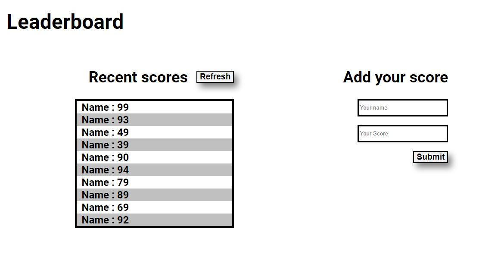

# To-Do List App

> I have done this project with Javascript,Html and CSS, which will use API to fetch data from other parties.



## Built With
- Html
- CSS
- Javascript

## Live Demo (if available)

-Not yet deployed


## Getting Started

To get a local copy up and running follow these simple example steps.
```
git clone  https://github.com/NatanimA/Leaderboard.git
```
```
git checkout -b development
```
```
git pull origin development
```

```
npm run start
```
### Prerequisites

```
No PREREQUISTIES NEEDED
```

### Setup

### Install

### Usage

### Run tests

### Deployment

### Live Link


## Authors

👤 **Natanim Abesha**

- GitHub: [@githubhandle](https://github.com/NatanimA)
- LinkedIn: [LinkedIn](https://linkedin.com/in/natanim-abesha-04a39823a)


## 🤝 Contributing

Contributions, issues, and feature requests are welcome!

Feel free to check the [issues page](../../issues/).

## Show your support

Give a ⭐️ if you like this project!

## Acknowledgments

- Hat tip to anyone whose code was used
- Inspiration
- etc

## 📝 License

This project is [MIT](./LICENSE) licensed.
